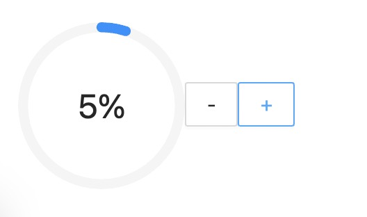

# 【Redux 系列】从简单例子入门到如何用 TS 实现 Redux

## Getting Started

本次文章目的很简单就是想通过一个简单的例子让新手熟悉 `Redux` 在 `TS` 中的使用，以及对于老手巩固一下`Redux` 的核心实现原理。

> 文章不会过多介绍概念内容，相信你是对 `Redux` 概念是有一定理解的

### Redux Flow

- redux 可以将应用程序的整个全局状态存储在一个单一的 store 对象树中
- 全局转态是不可以直接修改的，需要派发一个 action 即一个动作给 store 修改
- 为了描述 action 如何改变状态 ，你需要编写 reducer 函数，该函数基于旧状态和操作计算新状态
- 通过发布订阅模式 订阅 store 中的状态变化来更新视图

### 准备阶段

为了简单方便这里直接使用 Umi 来生成基础开发模板

```bash
mkdir implement-redux
cd implement-redux
yarn create @umijs/umi-app
yarn install
yarn start
```

初始化好项目后，我们实现一下 Redux [github](https://github.com/reduxjs/redux/blob/master/README.md) 上的加加减减的基本示例。

进入`src/pages/index.tsx ` 开始实现如下图所示的效果，可以看到目前状态并没有保存在全局状态中，看着很简单对吧。下面我们使用 redux 将该组件的状态放在全局状态树中托管。



```tsx
import { useState } from 'react';
import { Button, Progress } from 'antd';

export default function IndexPage() {
  const [value, setValue] = useState<number>(0);

  // TODO 这是一个加操作
  const handleIncremented = () => setValue(value + 1);

  // TODO 这是一个减操作
  const handleDecremented = () => setValue(value - 1);

  return (
    <div>
      <Progress type="circle" percent={value} />
      <Button onClick={handleDecremented}>-</Button>
      <Button onClick={handleIncremented}>+</Button>
    </div>
  );
}
```

### 安装 Redux

```bash
yarn install redux
cd src/
mkdir store
```

创建好文件是下面这样，store 这个文件夹专门用来存放 redux 相关的操作

```text
store
├─ reducers
│  ├─ counter.ts
│  └─ index.ts
└─ index.ts
```

实例比较简单，为了看着方便就将 type、action、reducer 放在一个文件中，当然你也可以抽出来放在不同的文件中，

**`reducers/counter.ts`**

```tsx
export interface CountProps {
  value: number;
}
// state 初始值
export const initialState: CountProps = {
  value: 0,
};
// action-type
const INCREMENTED = 'INCREMENTED';
const DECREMENTED = 'DECREMENTED';
// action 类型别名
type DoIncremented = {
  type: typeof INCREMENTED;
  payload: number;
};

type DoDecremented = {
  type: typeof DECREMENTED;
  payload: number;
};
// action
// TODO 增加时候派发的action
export const incremented = (param: number): DoIncremented => {
  return {
    type: INCREMENTED,
    payload: param,
  };
};
// TODO 减少时候派发的action
export const decremented = (param: number): DoDecremented => {
  return {
    type: DECREMENTED,
    payload: param,
  };
};
// 为了方便使用action 用对象保存起来
export const actionCreators = {
  incremented,
  decremented,
};
// reducer 的action 类型定义
type Action = DoIncremented | DoDecremented;

// reducer 纯函数
export default function (
  state: CountProps = initialState,
  action: Action,
): CountProps {
  switch (action.type) {
    case INCREMENTED:
      return { value: state.value + action.payload };
    case DECREMENTED:
      return { value: state.value - action.payload };
    default:
      return state;
  }
}
```

`reducers/index.ts` 中 `combineReducers` 将多个 `reducer` 结合在一起导出合并后的`combinedReducer` 函数

**`reducers/index.ts`**

```tsx
import counter from './counter';
import { combineReducers } from 'redux';

let reducers = {
  counter,
};
let combinedReducer = combineReducers(reducers);
export default combinedReducer;
```

将结合后的`combinedReducer` 作为参数传入 `createStore` 方法中生成`store`对象
**`store/index.ts`**

```tsx
import { createStore } from 'redux';
import combinedReducer from './reducers';
let store = createStore(combinedReducer);
export default store;
```

让我们再回到 pages/index.tsx 页面对原先的组件进行改造

- 引入 store 获取 store 里面的方法
- getState 获取全局状态树
- dispatch 派发 action
- subscribe 订阅状态更新

```tsx
import { useState, useEffect } from 'react';
import { Button, Progress } from 'antd';
import store from '@/store';
import { actionCreators } from '@/store/reducers/counter';

export default function IndexPage() {
  const [value, setValue] = useState<number>();
  const { getState, dispatch, subscribe } = store;

  useEffect(() => {
    const unsubscribe = subscribe(() => setValue(getState().counter.value));
    return unsubscribe;
  }, []);

  // TODO 这是一个加操作
  const handleIncremented = () => dispatch(actionCreators.incremented(2));

  // TODO 这是一个减操作
  const handleDecremented = () => dispatch(actionCreators.decremented(1));

  return (
    <div style={{ margin: '20px' }}>
      <Progress type="circle" percent={value} />
      <Button onClick={handleDecremented}>-</Button>
      <Button onClick={handleIncremented}>+</Button>
    </div>
  );
}
```

redux 还提供了一个 `bindActionCreators(actionCreators, dispatch)` 可以对每个 action 进行包装添加 dispatch， 返回一个对象，对上面的代码稍微改动一下，其实我觉得直接使用 dispatch 也挺方便的像 react-redux 里面 useDispatch() 这个 hook 也是直接使用 dispatch 派发 action。

```tsx
import { useState, useEffect } from 'react';
import { Button, Progress } from 'antd';
import store from '@/store';
import { bindActionCreators, Dispatch, AnyAction } from 'redux';
import { actionCreators } from '@/store/reducers/counter';

export default function IndexPage() {
  const [value, setValue] = useState<number>();
  const { getState, dispatch, subscribe } = store;

  useEffect(() => {
    const unsubscribe = subscribe(() => setValue(getState().counter.value));
    return unsubscribe;
  }, []);

  const actionMapObject = bindActionCreators(
    actionCreators,
    dispatch as Dispatch<AnyAction>,
  );
  // TODO 这是一个加操作
  const handleIncremented = () => actionMapObject.incremented(2);

  // TODO 这是一个减操作
  const handleDecremented = () => actionMapObject.decremented(2);

  return (
    <div style={{ margin: '20px' }}>
      <Progress type="circle" percent={value} />
      <Button onClick={handleDecremented}>-</Button>
      <Button onClick={handleIncremented}>+</Button>
    </div>
  );
}
```

上面我们完成了一个控制进度条的一个小 demo 代码比较简单，下面我先就对于这个例子所用到的 Redux 方法进行实现，总共使用到了三个方法分别是 `createStore`、`combineReducers`、`bindActionCreators`,逐一实现一下。

在 src 目录下新建一个 redux 文件夹 并且 创建 createStore.ts 文件

```bash
cd src
mkdir redux
touch createStore.ts
```

### 分析 createStore

createStore 在使用发现他接受一个 reducer 函数然后返回一个对象，对象分别有 getState、dispatch、subscribe 方法，就不难得出如下所示基础的代码结构了

```tsx
export default function createStore(reducer) {
  /*
  读取存储管理的状态。
  @return应用程序的当前状态。
  */
  function getState() {}
  /* 派发action */
  function dispatch() {}
  /* 订阅状态变化 */
  function subscribe() {}
  return {
    getState,
    dispatch,
    subscribe,
  };
}
```

此时 reducer 参数是 any 需要我们进行类型定义, 定义一个 Reducer 是一个函数类型 type 接受两个参数 state 和 action 参数的类型定义，只有在使用中才知道需要泛型传入

```ts
type Reducer<S, A> = (state: S | undefined, action: A) => S;
```

对泛型 A 进行约束, action 对象必须具备 type 属性才行

> extends 在这里的意思是 A 必须满足 Action 的条件

```ts
interface Action<T = any> {
  type: T;
}
interface AnyAction extends Action {
  // 允许在操作中定义任何额外的属性。
  [extraProps: string]: any;
}

export type Reducer<S, A extends Action = AnyAction> = (
  state: S | undefined,
  action: A,
) => S;
```

createStore 接受泛型 S 和 A， A 满足 Action 约束并且 不传默认是 AnyAction, createStore 还可以接受一个可选的初始状态，这边一起也加上去

```ts
export default function createStore<S, A extends Action = AnyAction>(
  reducer: Reducer<S, A>,
  preloadedState?:S
) {
  let currentState = preloadedState as S; // currentState 是 store 中的全局状态
  ...
}
```

#### getState

getState 这个方法很简单，就是直接返回全局状态就好了

```ts
export default function createStore<S, A extends Action = AnyAction>(
  reducer: Reducer<S, A>,
  preloadedState?:S
) {

  let currentState = preloadedState as S;
  /*
  读取存储管理的状态。
  @return应用程序的当前状态。
  */
  function getState() {
    return currentState;
  }
  ...
}
```

### subscribe

subscribe 就是一个发布订阅，将需要订阅的函数保存在一个数组里面并且返回一个取消当前订阅的函数

```tsx
...

let currentListeners: (() => void)[] = [];

function subscribe(listener: () => void) {
  if (typeof listener !== 'function') {
    throw new Error('Expected the listener to be a function');
  }
  currentListeners.push(listener);
  return function () {
    currentListeners = currentListeners.splice(
      currentListeners.indexOf(listener),
      1,
    );
  };
}

...
```

#### dispatch

- 根据 reducer 返回值设置新状态
- 执行所有 subscribe 方法所订阅的函数
- 返回当前执行的 action

```ts
export default function createStore<S, A extends Action = AnyAction>(
  reducer: Reducer<S, A>,
  preloadedState?:S
) {

  ...
  /* 派发action */
  function dispatch(action: A) {
    currentState = reducer(currentState, action);
    for (let i = 0; i < currentListeners.length; i += 1) {
      const listener = currentListeners[i];
      listener();
    }
    return action;
  }
  ...
}
```

现在 createStore 方法已经完成的差不多了，但是还有个细节需要考虑，就是考虑全局状态的初始值，假设 createStore 方法没有给它传递初始值，那么一开始 通过 getState() 获取到的就是 undefined，这时候就需要我们内部 派发一个不存在的 action type，将 reducer 的初始值设置给 全局转态上。

```tsx
const randomString = () =>
  Math.random().toString(36).substring(7).split('').join('.');

const ActionTypes = {
  INIT: `@@redux/INIT${/* #__PURE__ */ randomString()}`,
};

export default function createStore<S, A extends Action = AnyAction>(
  reducer: Reducer<S, A>,
  preloadedState?:S
) {
  ...

  dispatch({ type: ActionTypes.INIT } as A);

  ...
}
```

这时候 createStore 大致功能就差不多够用了。
